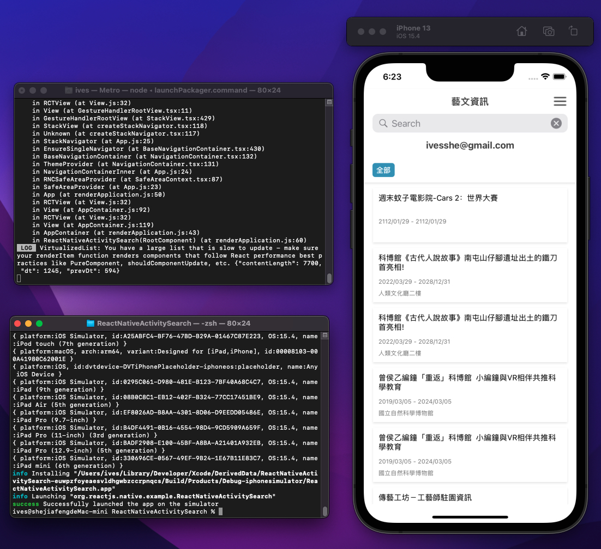
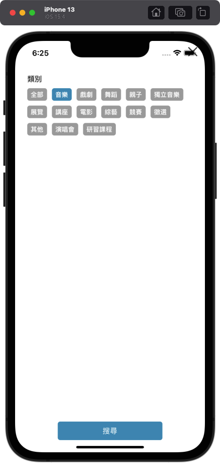
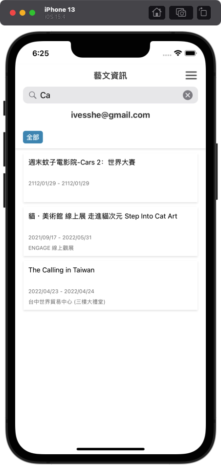

# React Native 藝文資詢查詢App

# 使用技術

- react
- react-native
- @react-native-community/masked-view
- @react-navigation/native
- @react-navigation/stack
- react-native-gesture-handler
- react-native-reanimated
- react-native-safe-area-context
- react-native-screens
- metro-react-native-babel-preset


# 使用設備及環境

- Mac mini M1
- macOS Monterey 12.2.1
- node 16.10.0

# 頁面展示

首頁、終端機



首頁


詳情頁面


詳情頁面-地圖


類別頁面



首頁-搜尋bar



# 影片展示

https://youtu.be/-RqltUBzr_Y

# 參考項目

https://github.com/IvesShe/ReactNative_Note

https://github.com/IvesShe/ReactNative_TxClass

https://github.com/IvesShe/ReactNativeCalculate

# 運行

```bash
npx react-native run-ios
```

# 官網安裝參考

https://reactnative.cn/docs/environment-setup

